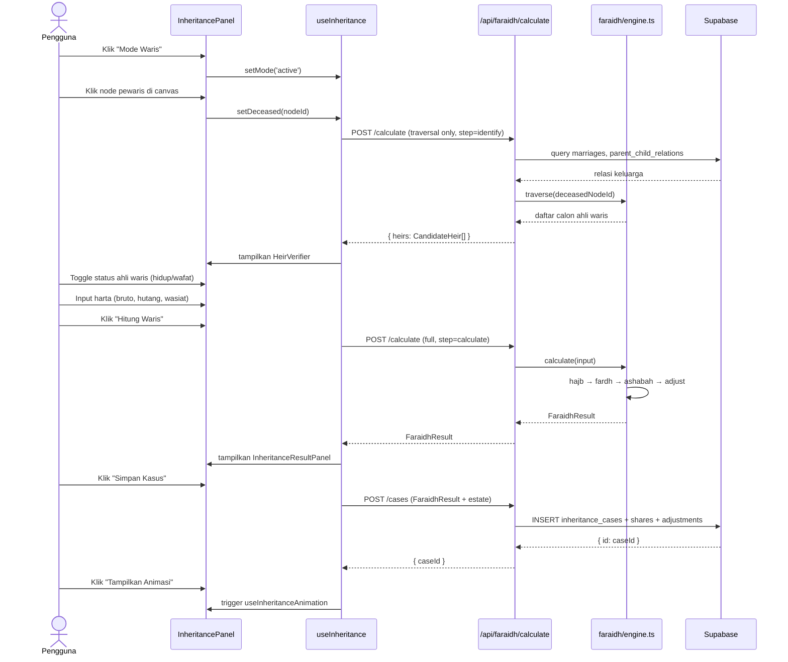

# Design Document: Faraidh Simulator

## Overview

Faraidh Simulator adalah modul kalkulator waris Islam (mazhab Syafi'i) yang terintegrasi ke halaman `/tree` yang sudah ada. Fitur ini memungkinkan pengguna memilih pewaris dari visualisasi ReactFlow, melakukan traversal otomatis terhadap graph keluarga Supabase, menghitung pembagian harta dengan engine faraidh berbasis pecahan presisi tinggi, dan memvisualisasikan hasilnya dengan animasi di canvas — semua tanpa mengubah fungsionalitas tree yang ada.

Pendekatan desain adalah **non-destructive extension**: semua kode baru ditambah sebagai komponen, hook, dan API route baru. File `page.tsx`, `TreeHeader.tsx`, `FamilyNode.tsx`, dan `useFamilyTree.ts` yang sudah ada hanya menerima tambahan props opsional atau import baru — tidak ada penghapusan atau perubahan logika yang ada.

---

## Arsitektur Keseluruhan

```mermaid
graph TD
    subgraph "Halaman /tree (existing)"
        PT[page.tsx]
        TH[TreeHeader.tsx]
        FN[FamilyNode.tsx]
        UFT[useFamilyTree.ts]
    end

    subgraph "Komponen Baru — inheritance/"
        IMT[InheritanceModeToggle]
        IP[InheritancePanel]
        DS[DeceasedSelector]
        HV[HeirVerifier]
        EIF[EstateInputForm]
        IRP[InheritanceResultPanel]
        ILD[InheritanceLegalDetail]
        HBO[HeirBadgeOverlay]
        BNO[BlockedNodeOverlay]
        AIE[AnimatedInheritanceEdge]
        ISO[InheritanceSummaryOverlay]
    end

    subgraph "Hooks Baru"
        UI[useInheritance]
        UIA[useInheritanceAnimation]
    end

    subgraph "Engine — src/lib/faraidh/"
        ENG[engine.ts]
        TRV[traverse.ts]
        HAJ[hajb.ts]
        FRD[fardh.ts]
        ASB[ashabah.ts]
        ADJ[adjustment.ts]
        FRC[fractions.ts]
        TYP[types.ts]
    end

    subgraph "API Routes — /api/faraidh/"
        CALC[POST /calculate]
        CASES[POST /cases]
        LIST[GET /cases]
        DETAIL[GET /cases/:id]
        PATCH[PATCH /cases/:id]
        DEL[DELETE /cases/:id]
        PDF[GET /cases/:id/pdf]
        SHARE[POST /cases/:id/share]
    end

    subgraph "Database — Supabase"
        IC[inheritance_cases]
        IS[inheritance_shares]
        IA[inheritance_adjustments]
    end

    PT -->|import + optional props| TH
    PT -->|import + optional props| FN
    PT -->|import| UI
    PT -->|import| UIA
    PT -->|render| IP
    PT -->|render overlay| HBO
    PT -->|render overlay| BNO
    PT -->|render overlay| ISO
    PT -->|edgeTypes| AIE

    TH -->|render| IMT
    IP --> DS
    IP --> HV
    IP --> EIF
    IP --> IRP
    IRP --> ILD

    UI --> IP
    UIA --> HBO
    UIA --> BNO
    UIA --> AIE
    UIA --> ISO

    CALC --> ENG
    ENG --> TRV
    ENG --> HAJ
    ENG --> FRD
    ENG --> ASB
    ENG --> ADJ
    ENG --> FRC
    TRV -->|query| IC
    CASES -->|write| IC
    CASES -->|write| IS
    CASES -->|write| IA
    LIST -->|read| IC
    DETAIL -->|read| IC
    DETAIL -->|read| IS
    DETAIL -->|read| IA
```



---

## Sequence Diagram — Alur Kalkulasi Utama



---

## Database Migrations

Tiga tabel baru ditambahkan melalui file migration `018_create_faraidh_tables.sql` di `db/schema/2026-clean/migrations/`.

### Tabel `inheritance_cases`

```sql
CREATE TABLE inheritance_cases (
    id          UUID PRIMARY KEY DEFAULT gen_random_uuid(),
    deceased_node_id  INTEGER NOT NULL REFERENCES nodes(id) ON DELETE RESTRICT,
    family_id         INTEGER REFERENCES nuclear_families(id) ON DELETE SET NULL,
    extended_group_id BIGINT  REFERENCES extended_family_groups(id) ON DELETE SET NULL,

    total_estate_gross NUMERIC(18,2) NOT NULL CHECK (total_estate_gross >= 0),
    total_debt         NUMERIC(18,2) NOT NULL DEFAULT 0 CHECK (total_debt >= 0),
    total_wasiat       NUMERIC(18,2) NOT NULL DEFAULT 0 CHECK (total_wasiat >= 0),
    total_estate_net   NUMERIC(18,2) GENERATED ALWAYS AS
                         (total_estate_gross - total_debt - total_wasiat) STORED,

    madhab   VARCHAR(20) NOT NULL DEFAULT 'syafii'
                 CHECK (madhab IN ('syafii')),
    status   VARCHAR(20) NOT NULL DEFAULT 'draft'
                 CHECK (status IN ('draft', 'final', 'archived')),

    created_by INTEGER NOT NULL REFERENCES users(id) ON DELETE RESTRICT,
    created_at TIMESTAMPTZ DEFAULT NOW(),
    updated_at TIMESTAMPTZ DEFAULT NOW()
);

CREATE INDEX idx_ic_deceased    ON inheritance_cases(deceased_node_id);
CREATE INDEX idx_ic_family      ON inheritance_cases(family_id);
CREATE INDEX idx_ic_created_by  ON inheritance_cases(created_by);
CREATE INDEX idx_ic_ext_group   ON inheritance_cases(extended_group_id);
```

### Tabel `inheritance_shares`

```sql
CREATE TABLE inheritance_shares (
    id             UUID PRIMARY KEY DEFAULT gen_random_uuid(),
    case_id        UUID NOT NULL REFERENCES inheritance_cases(id) ON DELETE CASCADE,
    heir_node_id   INTEGER NOT NULL REFERENCES nodes(id) ON DELETE RESTRICT,

    relationship_type  VARCHAR(30) NOT NULL,
    category           VARCHAR(20) NOT NULL CHECK (category IN ('fardh','ashabah','blocked')),

    fraction_numerator   INTEGER NOT NULL,
    fraction_denominator INTEGER NOT NULL CHECK (fraction_denominator > 0),
    share_amount         NUMERIC(18,2) NOT NULL DEFAULT 0,

    is_blocked        BOOLEAN NOT NULL DEFAULT false,
    blocked_by_node_id INTEGER REFERENCES nodes(id) ON DELETE SET NULL,
    hajb_type         VARCHAR(20) CHECK (hajb_type IN ('hirman','nuqshan')),

    quran_reference VARCHAR(100),
    explanation     TEXT,
    display_order   INTEGER NOT NULL DEFAULT 0,

    created_at TIMESTAMPTZ DEFAULT NOW(),
    updated_at TIMESTAMPTZ DEFAULT NOW()
);

CREATE INDEX idx_is_case_id      ON inheritance_shares(case_id);
CREATE INDEX idx_is_heir_node_id ON inheritance_shares(heir_node_id);
```

### Tabel `inheritance_adjustments`

```sql
CREATE TABLE inheritance_adjustments (
    id              UUID PRIMARY KEY DEFAULT gen_random_uuid(),
    case_id         UUID NOT NULL REFERENCES inheritance_cases(id) ON DELETE CASCADE,
    adjustment_type VARCHAR(10) NOT NULL CHECK (adjustment_type IN ('aul','radd')),
    original_asal   INTEGER NOT NULL,
    adjusted_asal   INTEGER NOT NULL,
    reason          TEXT,
    created_at      TIMESTAMPTZ DEFAULT NOW()
);

CREATE INDEX idx_ia_case_id ON inheritance_adjustments(case_id);
```

### Row Level Security (RLS)

```sql
-- inheritance_cases: hanya anggota nuclear family ATAU extended group yang sama
ALTER TABLE inheritance_cases ENABLE ROW LEVEL SECURITY;

CREATE POLICY "family_members_select" ON inheritance_cases
  FOR SELECT USING (
    deceased_node_id IN (
      SELECT n.id FROM nodes n
      WHERE n.current_nuclear_family_id IN (
        SELECT nfm.nuclear_family_id
        FROM nuclear_family_memberships nfm
        JOIN nodes me ON me.user_id = auth.uid()::text::integer
        WHERE nfm.node_id = me.id AND nfm.is_active = true
      )
    )
    OR extended_group_id IN (
      SELECT neg.extended_group_id
      FROM node_extended_groups neg
      JOIN nodes me ON me.user_id = auth.uid()::text::integer
      WHERE neg.node_id = me.id
    )
  );

CREATE POLICY "owner_insert" ON inheritance_cases
  FOR INSERT WITH CHECK (
    created_by = (SELECT id FROM users WHERE id::text = auth.uid()::text LIMIT 1)
  );

CREATE POLICY "owner_update" ON inheritance_cases
  FOR UPDATE USING (
    created_by = (SELECT id FROM users WHERE id::text = auth.uid()::text LIMIT 1)
  );

-- Terapkan RLS yang sama ke inheritance_shares dan inheritance_adjustments via case_id FK
ALTER TABLE inheritance_shares ENABLE ROW LEVEL SECURITY;
CREATE POLICY "via_case" ON inheritance_shares
  FOR ALL USING (
    case_id IN (SELECT id FROM inheritance_cases)
  );

ALTER TABLE inheritance_adjustments ENABLE ROW LEVEL SECURITY;
CREATE POLICY "via_case" ON inheritance_adjustments
  FOR ALL USING (
    case_id IN (SELECT id FROM inheritance_cases)
  );
```

---

## Engine Faraidh (`src/lib/faraidh/`)

### `types.ts` — Seluruh type definitif

```typescript
export interface Fraction {
  numerator: number; // selalu integer, sudah disederhanakan
  denominator: number; // selalu positif integer, selalu > 0
}

export type RelationshipType =
  | "suami"
  | "istri"
  | "anak_laki"
  | "anak_perempuan"
  | "ayah"
  | "ibu"
  | "kakek_paternal"
  | "nenek_paternal"
  | "saudara_laki_kandung"
  | "saudara_perempuan_kandung"
  | "saudara_laki_seayah"
  | "saudara_perempuan_seayah"
  | "paman_kandung"
  | "paman_seayah";

export type HeirCategory = "fardh" | "ashabah" | "ashabah_maal_ghair";
export type HajbType = "hirman" | "nuqshan";
export type AdjustmentType = "aul" | "radd";
export type CaseStatus = "draft" | "final" | "archived";

export interface CandidateHeir {
  nodeId: string;
  name: string;
  gender: "male" | "female";
  isAlive: boolean; // dari data node, bisa dioverride pengguna
  relationship: RelationshipType;
  marriageOrder?: number; // untuk istri ke-N (poligami)
}

export interface HeirShare {
  nodeId: string;
  name: string;
  relationship: RelationshipType;
  category: HeirCategory;
  fraction: Fraction; // setelah aul/radd
  fractionOriginal: Fraction; // sebelum aul/radd
  percentage: number; // fraction * 100, 4 desimal
  amount: number; // rupiah, integer (Math.round)
  quranRef: string; // misal "QS An-Nisa: 11"
  explanation: string; // Bahasa Indonesia
}

export interface BlockedHeir {
  nodeId: string;
  name: string;
  relationship: RelationshipType;
  blockedByNodeId: string;
  blockedByName: string;
  hajbType: HajbType;
  explanation: string; // Bahasa Indonesia
}

export interface AdjustmentRecord {
  type: AdjustmentType;
  originalAsal: number; // misal 6 (sebelum aul)
  adjustedAsal: number; // misal 7 (sesudah aul)
  reason: string;
}

export interface FaraidhInput {
  deceasedNodeId: string;
  activeHeirs: CandidateHeir[]; // sudah difilter pengguna (is_alive = true)
  estateGross: number;
  totalDebt: number;
  totalWasiat: number; // max 1/3 estateGross, divalidasi sebelum masuk engine
}

export interface FaraidhResult {
  deceasedNodeId: string;
  estateNet: number;
  heirs: HeirShare[];
  blockedHeirs: BlockedHeir[];
  adjustment?: AdjustmentRecord;
  totalDistributed: number; // HARUS === estateNet (invariant)
}
```

### `fractions.ts` — Aritmetika Pecahan Presisi Tinggi

```typescript
// Semua operasi mengembalikan Fraction yang sudah disederhanakan (GCD reduction)
export function gcd(a: number, b: number): number;
export function fraction(n: number, d: number): Fraction;
// Precondition: d !== 0 — lempar InvalidFractionError jika d === 0
// Postcondition: GCD(result.numerator, result.denominator) === 1 && result.denominator > 0

export function addFrac(a: Fraction, b: Fraction): Fraction;
// result = (a.n*b.d + b.n*a.d) / (a.d*b.d), kemudian disederhanakan

export function subFrac(a: Fraction, b: Fraction): Fraction;
export function mulFrac(a: Fraction, b: Fraction): Fraction;
export function divFrac(a: Fraction, b: Fraction): Fraction;
// Precondition: b.numerator !== 0

export function compareFrac(a: Fraction, b: Fraction): -1 | 0 | 1;
// Bandingkan a.n * b.d vs b.n * a.d

export function fractionToDecimal(f: Fraction): number;
export function fractionToString(f: Fraction): string; // "1/4", "3/8", "1/1"
export function parseFraction(s: string): Fraction;
// Format: "N/D" — lempar ParseError jika format salah
// Round-trip: parseFraction(fractionToString(f)) ekuivalen dengan f

export function ZERO(): Fraction; // { numerator: 0, denominator: 1 }
export function ONE(): Fraction; // { numerator: 1, denominator: 1 }
```

**Loop Invariant (addFrac):** Pada setiap tahap reduksi GCD, nilai numerik pecahan tidak berubah — hanya representasinya yang disederhanakan.

### `traverse.ts` — Graph Traversal dari Supabase

```typescript
export interface TraversalResult {
  spouses: CandidateHeir[]; // status 'married' saja
  sons: CandidateHeir[];
  daughters: CandidateHeir[];
  father: CandidateHeir | null;
  mother: CandidateHeir | null;
  paternalGrandfather: CandidateHeir | null;
  paternalGrandmother: CandidateHeir | null;
  fullBrothers: CandidateHeir[];
  fullSisters: CandidateHeir[];
  halfBrothers: CandidateHeir[]; // saudara seayah
  halfSisters: CandidateHeir[];
}

export async function traverseHeirs(
  deceasedNodeId: string,
  supabase: SupabaseClient,
): Promise<TraversalResult>;
// Query sequence:
// 1. marriages WHERE (husband_node_id OR wife_node_id) = deceasedNodeId AND status = 'married'
// 2. parent_child_relations WHERE parent_node_id = deceasedNodeId (anak)
// 3. parent_child_relations WHERE child_node_id = deceasedNodeId (orang tua)
// 4. Jika ada father_node_id: cari saudara (parent_child_relations WHERE parent_node_id = father_node_id)
// 5. Untuk kakek: parent_child_relations WHERE child_node_id = father_node_id AND parent_type = 'father'
```

### `hajb.ts` — Aturan Hajb Mazhab Syafi'i

```typescript
export interface HajbResult {
  activeHeirs: CandidateHeir[];
  blockedHeirs: BlockedHeir[];
}

export function applyHajb(heirs: CandidateHeir[]): HajbResult;

// Aturan Hajb Hirman (implementasi):
// R1: Jika ada anak (laki atau perempuan) → saudara kandung/seayah terhajb
// R2: Jika ada ayah → kakek paternal terhajb
// R3: Jika ada anak laki → saudari kandung tidak dapat bagian fardh maupun ashabah ma'al ghair
// R4: Jika ada anak laki → nenek paternal terhajb
//
// Aturan Hajb Nuqshan (diimplementasi di fardh.ts, bukan di sini):
// - Keberadaan anak: ibu 1/3 → 1/6, suami 1/2 → 1/4, istri 1/4 → 1/8
//
// Precondition: heirs adalah daftar ahli waris AKTIF (is_alive = true)
// Postcondition: activeHeirs ∩ blockedHeirs = ∅
//                activeHeirs ∪ blockedHeirs = heirs (semua diakuntansi)
```

### `fardh.ts` — Perhitungan Ashhabul Furudh

```typescript
export function calculateFardh(
  activeHeirs: CandidateHeir[],
  deceasedGender: "male" | "female",
): Map<string, Fraction>; // nodeId → fardh fraction

// Tabel bagian fardh (Syafi'i):
// Suami:          1/2 (tanpa anak), 1/4 (dengan anak)
// Istri (semua):  1/4 (tanpa anak), 1/8 (dengan anak) — dibagi rata antar istri
// Ibu:            1/3 (tanpa anak & < 2 saudara), 1/6 (dengan anak atau ≥ 2 saudara)
// Ayah:           1/6 (dengan anak laki) — jika tidak ada anak, ayah = ashabah
// Anak perempuan: 1/2 (1 orang tanpa anak laki), 2/3 (≥2 orang tanpa anak laki)
//                 → ashabah bil ghair jika ada anak laki
// Kakek paternal: sama seperti ayah jika ayah tidak ada
//
// Hajb Nuqshan diterapkan di sini berdasarkan komposisi activeHeirs
```

### `ashabah.ts` — Perhitungan 'Ashabah

```typescript
export function calculateAshabah(
  activeHeirs: CandidateHeir[],
  fardhMap: Map<string, Fraction>,
  remainingFraction: Fraction, // 1 - sum(fardhMap values)
): Map<string, Fraction>; // nodeId → ashabah fraction

// Urutan prioritas ashabah binafsih (Syafi'i):
// 1. Anak laki-laki
// 2. Cucu laki-laki dari anak laki (jika tidak ada anak laki)
// 3. Ayah (jika tidak ada anak)
// 4. Kakek paternal (jika tidak ada ayah)
// 5. Saudara laki kandung
// 6. dst.
//
// Ashabah bil ghair: anak perempuan menjadi ashabah bersama anak laki
// Rasio: anak laki mendapat 2x bagian anak perempuan (QS An-Nisa: 11)
//
// Precondition: sum(fardhMap values) <= 1 (sudah divalidasi)
// Postcondition: sum(all shares) <= 1, sisa diberikan ke ashabah pertama
```

### `adjustment.ts` — 'Aul dan Radd

```typescript
export function applyAul(shares: Map<string, Fraction>): {
  adjusted: Map<string, Fraction>;
  record: AdjustmentRecord;
};
// Precondition: sum(shares) > 1 (total fardh melebihi harta)
// Algoritma:
//   1. Hitung original_asal = LCM dari semua denominator
//   2. Hitung total pembilang = sum(n_i) — ini akan > original_asal
//   3. adjusted_asal = total pembilang
//   4. Setiap bagian baru = n_i / adjusted_asal (disederhanakan)
// Postcondition: sum(adjusted shares) === 1

export function applyRadd(
  shares: Map<string, Fraction>,
  eligibleNodeIds: string[], // biasanya semua ahli waris kecuali suami/istri
): { adjusted: Map<string, Fraction>; record: AdjustmentRecord };
// Precondition: sum(shares) < 1 AND tidak ada ashabah
// Algoritma:
//   1. Hitung sisa = 1 - sum(shares)
//   2. Distribusikan sisa proporsional ke eligibleNodeIds berdasarkan fardh mereka
// Postcondition: sum(adjusted shares) === 1
```

### `engine.ts` — Orchestrator

```typescript
export async function runFaraidhEngine(
  input: FaraidhInput,
  supabase: SupabaseClient,
): Promise<FaraidhResult>;

// Pipeline:
// 1. Validasi input (estateNet > 0, activeHeirs.length > 0)
// 2. Tentukan gender pewaris dari DB
// 3. applyHajb(input.activeHeirs) → { activeHeirs, blockedHeirs }
// 4. calculateFardh(activeHeirs, deceasedGender) → fardhMap
// 5. Hitung totalFardh = sum(fardhMap values)
// 6. IF totalFardh > 1: applyAul(fardhMap)
//    ELSE IF totalFardh < 1 AND tidak ada ashabah: applyRadd(fardhMap, eligibleIds)
//    ELSE: calculateAshabah(activeHeirs, fardhMap, 1 - totalFardh)
// 7. Konversi fraction ke amount: Math.round(fraction * estateNet)
// 8. Distribusi sisa pembulatan ke ahli waris dengan share terbesar
// 9. Assert: sum(amount) === estateNet (jika tidak, lempar InvariantViolationError)
// 10. Return FaraidhResult

// Invariant Utama: totalDistributed === estateNet (integer rupiah)
// Loop Invariant (step 6): Setiap iterasi hanya memproses 1 ahli waris,
//   total fraction yang sudah diassign tidak pernah melebihi 1
```

---

## API Routes (`src/app/api/faraidh/`)

### `POST /api/faraidh/calculate`

Stateless. Tidak menulis ke DB. Digunakan untuk kalkulasi real-time.

```typescript
// Request body:
interface CalculateRequest {
  step: "identify" | "calculate";
  deceasedNodeId: string;
  // Hanya untuk step = 'calculate':
  activeHeirs?: CandidateHeir[]; // override is_alive dari pengguna
  estateGross?: number;
  totalDebt?: number;
  totalWasiat?: number;
}

// Response (step = 'identify'):
interface IdentifyResponse {
  candidates: CandidateHeir[];
}

// Response (step = 'calculate'):
interface CalculateResponse {
  result: FaraidhResult;
}

// Error responses:
// 401 — tidak terautentikasi
// 403 — node pewaris tidak dalam keluarga pengguna
// 400 — input tidak valid (estateNet <= 0, dsb)
// 422 — engine error (tidak ada ahli waris valid)
```

### `POST /api/faraidh/cases`

Simpan kasus ke DB. Membutuhkan autentikasi.

```typescript
interface SaveCaseRequest {
  result: FaraidhResult;
  estateGross: number;
  totalDebt: number;
  totalWasiat: number;
  madhab?: "syafii"; // default 'syafii'
}
// Response: { id: string } — UUID kasus yang baru disimpan
```

### `GET /api/faraidh/cases`

List kasus milik keluarga pengguna.

```
Query params: ?family_id=&page=1&per_page=50
Response: { cases: InheritanceCaseSummary[], total: number }
```

### `GET /api/faraidh/cases/[id]`

Detail kasus + shares + adjustments.

```
Response: { case: InheritanceCase, shares: InheritanceShare[], adjustments: InheritanceAdjustment[] }
403 jika bukan anggota keluarga yang sama
```

### `PATCH /api/faraidh/cases/[id]`

Update status (draft → final → archived).

```typescript
interface PatchCaseRequest {
  status: CaseStatus;
}
```

### `DELETE /api/faraidh/cases/[id]`

Soft delete: set `status = 'archived'` dan `updated_at = now()`.

### `GET /api/faraidh/cases/[id]/pdf`

Generate dan return PDF sebagai stream. Gunakan `@react-pdf/renderer` di server component.

```
Response: Content-Type: application/pdf
          Content-Disposition: attachment; filename="faraidh-[nama-pewaris]-[tanggal].pdf"
```

### `POST /api/faraidh/cases/[id]/share`

Kirim notifikasi in-app ke semua anggota extended group yang sama.

```typescript
interface ShareRequest {
  message?: string;
}
// Reuse tabel notifications yang sudah ada (migration 007)
// Validasi: penerima harus dalam extended_group yang sama dengan pengirim
```

---

## Komponen Frontend (`src/app/tree/components/inheritance/`)

### `InheritanceModeToggle.tsx`

Tombol yang dirender di dalam `TreeHeader`. Menggunakan color palette yang ada.

```typescript
interface InheritanceModeToggleProps {
  isActive: boolean;
  hasNodes: boolean; // dari page.tsx: nodes.length > 0
  onToggle: () => void;
}
// Render: tombol dengan ikon Scale dari lucide-react
// Warna aktif: bg-[#C4922A] text-white
// Warna nonaktif: border-[#4A7C59] text-[#4A7C59]
// Disabled jika !hasNodes → tooltip "Tambahkan anggota keluarga terlebih dahulu"
// Label: "Mode Waris" (nonaktif) | "Mode Waris: Aktif" (aktif)
```

**Integrasi non-destructive ke `TreeHeader.tsx`:**

Di `TreeHeader.tsx`, tambahkan props opsional berikut (tidak ubah yang sudah ada):

```typescript
// Tambahkan ke interface TreeHeaderProps (opsional agar backward compatible):
inheritanceMode?: boolean;
onToggleInheritanceMode?: () => void;
hasNodes?: boolean;

// Di dalam return JSX, di dalam div.flex.flex-wrap (setelah tombol "Bagikan Link"):
{onToggleInheritanceMode && (
  <InheritanceModeToggle
    isActive={inheritanceMode ?? false}
    hasNodes={hasNodes ?? false}
    onToggle={onToggleInheritanceMode}
  />
)}
```

### `InheritancePanel.tsx`

Panel slide-in 380px dari kanan canvas. Menggunakan `position: fixed` agar tidak mengganggu ReactFlow.

```typescript
interface InheritancePanelProps {
  isOpen: boolean;
  step:
    | "idle"
    | "select-deceased"
    | "verify-heirs"
    | "input-estate"
    | "result"
    | "history";
  deceased: CandidateHeir | null;
  candidates: CandidateHeir[];
  activeHeirs: CandidateHeir[];
  result: FaraidhResult | null;
  savedCaseId: string | null;
  isCalculating: boolean;
  onClose: () => void;
  onHeirToggle: (nodeId: string, isAlive: boolean) => void;
  onEstateChange: (gross: number, debt: number, wasiat: number) => void;
  onCalculate: () => void;
  onSaveCase: () => void;
  onShowAnimation: () => void;
  onResetAnimation: () => void;
  onTabChange: (tab: "simulasi" | "riwayat") => void;
}

// Layout:
// - position: fixed; right: 0; top: 64px (bawah navbar); height: calc(100vh - 64px)
// - width: 380px; z-index: 40 (di bawah modal yang z-50)
// - Animasi masuk: translate-x-full → translate-x-0 (CSS transition 300ms)
// - Background: #FDFAF5; border-left: 1px solid #D4C4A8
// - Header: "Simulator Faraidh" + tombol close (×)
// - Tab: [Simulasi | Riwayat]
// - Body: render sesuai `step` dan tab aktif
```

### `DeceasedSelector.tsx`

```typescript
interface DeceasedSelectorProps {
  // step = 'select-deceased'
  pendingNodeId: string | null; // node yang diklik di canvas
  pendingNodeData: CandidateHeir | null;
  onConfirm: (nodeId: string) => void;
  onCancel: () => void;
}
// UI:
// - Instruksi: "Klik node anggota keluarga yang telah wafat"
// - Jika pendingNodeId ada: dialog konfirmasi inline dengan nama + foto + tombol
// - Jika is_alive = true: error "Anggota ini masih hidup..."
```

### `HeirVerifier.tsx`

```typescript
interface HeirVerifierProps {
  candidates: CandidateHeir[];
  onToggle: (nodeId: string, isAlive: boolean) => void;
  onNext: () => void; // ke step input-estate
}
// Tampilkan list dengan toggle hidup/wafat
// Badge relasi: "Istri ke-1", "Anak Laki-laki", "Ibu Kandung", dsb.
// Ringkasan: "X ahli waris aktif"
// Tombol "Lanjut ke Input Harta" (disabled jika 0 ahli waris aktif)
```

### `EstateInputForm.tsx`

```typescript
interface EstateInputFormProps {
  gross: number;
  debt: number;
  wasiat: number;
  onChange: (field: "gross" | "debt" | "wasiat", value: number) => void;
  onCalculate: () => void;
  isCalculating: boolean;
}
// - Currency mask: format Rp 1.000.000 saat blur, hanya angka saat focus
// - Kalkulasi real-time: Harta Bersih = gross - debt - wasiat (≤300ms)
// - Validasi wasiat: jika wasiat > gross/3, auto-clamp ke gross/3 + warning
// - Disable "Hitung Waris" jika estateNet <= 0
// - Input negatif/non-numerik: tolak dengan pesan validasi
```

### `InheritanceResultPanel.tsx`

```typescript
interface InheritanceResultPanelProps {
  result: FaraidhResult;
  savedCaseId: string | null;
  onSave: () => void;
  onShowAnimation: () => void;
  onExportPdf: () => void;
  onShare: () => void;
  onOpenLegalDetail: (nodeId: string) => void;
}
// Tabel ahli waris: nama | relasi | dasar hukum | pecahan | persen | nominal Rp
// Section "Ahli Waris Terhajb" (hanya jika ada blockedHeirs)
// Catatan Aul/Radd (hanya jika adjustment ada)
// Disclaimer wajib di bawah tabel
// Tombol: Simpan | Tampilkan Animasi | Export PDF | Bagikan
```

### `InheritanceLegalDetail.tsx`

```typescript
interface InheritanceLegalDetailProps {
  isOpen: boolean;
  heir: HeirShare | BlockedHeir | null;
  onClose: () => void;
}
// Modal (z-60) dengan:
// - Nama ahli waris + relasi
// - Dasar hukum Al-Qur'an (quranRef)
// - Nama konsep hukum (hajb hirman, ashabah, dll)
// - Penjelasan lengkap Bahasa Indonesia
```

### Overlay Components

**`HeirBadgeOverlay.tsx`**

```typescript
interface HeirBadgeOverlayProps {
  heirs: HeirShare[];
  nodes: Node<FamilyNodeData>[]; // untuk mendapatkan posisi canvas
  reactFlowInstance: any; // untuk screenToFlowPosition
  estateNet: number;
}
// Render via React Portal ke document.body
// Posisi: absolute, mengikuti posisi node di canvas (reactFlowInstance.flowToScreenPosition)
// Setiap badge: nama (truncate 20 char) | persentase XX.XX% | nominal singkat (jt/M/T)
// Warna: bg-[#4A7C59] text-white, rounded-lg, shadow
// Animasi masuk: opacity 0 → 1 dengan delay berurutan (dikendalikan useInheritanceAnimation)
```

**`BlockedNodeOverlay.tsx`**

```typescript
interface BlockedNodeOverlayProps {
  blockedHeirs: BlockedHeir[];
  nodes: Node<FamilyNodeData>[];
  reactFlowInstance: any;
}
// Overlay abu-abu opacity 60% di atas node yang terhajb
// Label "Terhajb" di tengah overlay
// Warna: bg-gray-500/60, teks putih
```

**`AnimatedInheritanceEdge.tsx`**

Custom ReactFlow edge type. Terdaftar di `edgeTypes` di `page.tsx`.

```typescript
interface AnimatedInheritanceEdgeData {
  fraction: string; // "1/4"
  isActive: boolean; // false = tidak dirender
}
// Garis putus-putus animasi dengan warna emas #C4922A
// CSS keyframe via Tailwind arbitrary: stroke-dashoffset animation
// Inline style untuk animasi agar tidak butuh library tambahan:
// style={{ animation: 'inheritanceDash 1.5s linear infinite' }}
// @keyframes inheritanceDash ditambahkan di globals.css:
//   from { stroke-dashoffset: 24 } to { stroke-dashoffset: 0 }
// Tebal 3px, dasharray "8 4", warna #C4922A
// Berbeda secara visual dari edge relasi keluarga (hijau/biru/pink)
```

**`InheritanceSummaryOverlay.tsx`**

```typescript
interface InheritanceSummaryOverlayProps {
  result: FaraidhResult;
  isVisible: boolean;
}
// position: absolute; top: 16px; left: 16px (di dalam CardContent, bukan fixed)
// Tampilkan: total ahli waris aktif, total harta bersih (Rp), status Aul/Radd
// Warna: bg-[#FDFAF5]/90 border border-[#D4C4A8] rounded-xl shadow-md backdrop-blur
// z-index: 10 (di atas canvas ReactFlow tapi di bawah panel)
```

---

## Hooks (`src/app/tree/hooks/`)

### `useInheritance.ts`

State machine utama untuk seluruh alur fitur faraidh.

```typescript
type InheritanceStep =
  | "idle"
  | "select-deceased"
  | "verify-heirs"
  | "input-estate"
  | "result"
  | "history";

interface UseInheritanceReturn {
  // State
  isActive: boolean;
  step: InheritanceStep;
  deceased: CandidateHeir | null;
  pendingNodeId: string | null; // node diklik sebelum konfirmasi
  candidates: CandidateHeir[]; // dari API identify
  activeHeirs: CandidateHeir[]; // setelah toggle pengguna
  estateGross: number;
  totalDebt: number;
  totalWasiat: number;
  estateNet: number; // derived: gross - debt - wasiat
  result: FaraidhResult | null;
  savedCaseId: string | null;
  isCalculating: boolean;
  isSaving: boolean;
  error: string | null;

  // Actions
  toggle: () => void; // aktifkan/nonaktifkan mode waris
  handleNodeClick: (nodeId: string, nodeData: FamilyNodeData) => void;
  confirmDeceased: () => void;
  cancelDeceased: () => void;
  toggleHeirAlive: (nodeId: string, isAlive: boolean) => void;
  updateEstate: (field: "gross" | "debt" | "wasiat", value: number) => void;
  calculate: () => Promise<void>;
  saveCase: () => Promise<void>;
  reset: () => void; // kembali ke idle, clear semua state
  loadHistory: () => Promise<InheritanceCaseSummary[]>;
  loadCase: (caseId: string) => Promise<void>;
}

export function useInheritance(): UseInheritanceReturn;

// Implementasi state transitions:
// idle → select-deceased: saat toggle() dipanggil
// select-deceased → verify-heirs: saat confirmDeceased() sukses
// verify-heirs → input-estate: saat onNext dari HeirVerifier
// input-estate → result: saat calculate() sukses
// result → history: saat tab riwayat diklik
// Any → idle: saat reset() atau toggle() saat aktif
```

### `useInheritanceAnimation.ts`

Controller animasi sequential untuk overlay di canvas.

```typescript
interface UseInheritanceAnimationReturn {
  isAnimating: boolean;
  isComplete: boolean;
  visibleHeirIds: string[]; // node ID yang HeirBadge-nya sudah ditampilkan
  visibleBlockedIds: string[]; // node ID yang BlockedOverlay-nya ditampilkan
  activeEdgeIds: string[]; // edge ID yang AnimatedEdge-nya aktif
  showSummary: boolean;

  startAnimation: (result: FaraidhResult) => void;
  stopAnimation: () => void;
  resetAnimation: () => void;
}

export function useInheritanceAnimation(): UseInheritanceAnimationReturn;

// Sequence (menggunakan setTimeout, bukan library animasi):
// t=0ms:    highlight node pewaris (melalui selectedDeceasedId di useInheritance)
// t=500ms:  mulai tampilkan AnimatedInheritanceEdge ke heir[0], tambah ke activeEdgeIds
// t=800ms:  tampilkan HeirBadge heir[0] (tambah ke visibleHeirIds)
// t=1100ms: AnimatedInheritanceEdge ke heir[1], dst — jeda 300ms per heir
// Paralel:  BlockedNodeOverlay muncul bersamaan dengan heir terakhir
// t=final:  showSummary = true (InheritanceSummaryOverlay)
//
// stopAnimation: set isAnimating=false, bersihkan semua timeout via useRef<NodeJS.Timeout[]>
// resetAnimation: kosongkan semua array, showSummary=false, isComplete=false
```

---

## Integrasi Non-Destructive ke File Existing

### Perubahan di `page.tsx`

Hanya penambahan — tidak ada penghapusan atau modifikasi logika yang ada:

```typescript
// 1. Import baru (tambahkan di bagian atas)
import { InheritancePanel } from './components/inheritance/InheritancePanel';
import { HeirBadgeOverlay } from './components/inheritance/HeirBadgeOverlay';
import { BlockedNodeOverlay } from './components/inheritance/BlockedNodeOverlay';
import { InheritanceSummaryOverlay } from './components/inheritance/InheritanceSummaryOverlay';
import { AnimatedInheritanceEdge } from './components/inheritance/AnimatedInheritanceEdge';
import { useInheritance } from './hooks/useInheritance';
import { useInheritanceAnimation } from './hooks/useInheritanceAnimation';

// 2. Inisialisasi hooks baru (di dalam TreePage())
const inheritance = useInheritance();
const inheritanceAnim = useInheritanceAnimation();

// 3. Tambahkan AnimatedInheritanceEdge ke edgeTypes (gabungkan dengan yang ada)
const edgeTypes = useMemo(() => ({
  inheritanceEdge: AnimatedInheritanceEdge,
}), []);

// 4. Tambahkan inheritance edges ke ReactFlow edges
const inheritanceEdges = useMemo(() => {
  if (!inheritance.result) return [];
  return inheritanceAnim.activeEdgeIds.map(edgeId => ({
    id: edgeId,
    type: 'inheritanceEdge',
    source: inheritance.deceased?.nodeId ?? '',
    target: edgeId.replace('inh-', ''),
    data: { isActive: true },
  }));
}, [inheritanceAnim.activeEdgeIds, inheritance.result, inheritance.deceased]);

// 5. Di TreeHeader, tambahkan props baru (opsional):
<TreeHeader
  // ...props yang sudah ada (tidak berubah)...
  inheritanceMode={inheritance.isActive}
  onToggleInheritanceMode={inheritance.toggle}
  hasNodes={nodes.length > 0}
/>

// 6. Modifikasi onNodeClick: delegasikan ke inheritance jika mode aktif
const onNodeClick = useCallback(
  (_: React.MouseEvent, node: Node<FamilyNodeData>) => {
    if (inheritance.isActive && inheritance.step === 'select-deceased') {
      inheritance.handleNodeClick(node.id, node.data);
      return; // jangan buka NodeDetailModal saat mode waris aktif step ini
    }
    handleInfoClick(node.id);
  },
  [handleInfoClick, inheritance],
);

// 7. Render komponen baru (di luar CardContent, setelah semua modal yang ada):
<InheritancePanel
  isOpen={inheritance.isActive}
  step={inheritance.step}
  // ...props lainnya dari inheritance state...
  onShowAnimation={() => inheritanceAnim.startAnimation(inheritance.result!)}
  onResetAnimation={inheritanceAnim.resetAnimation}
/>

{/* Overlay di atas canvas — absolute, di dalam div CardContent parent */}
{inheritance.result && inheritanceAnim.showSummary && (
  <InheritanceSummaryOverlay result={inheritance.result} isVisible />
)}

{/* Portal overlays */}
{inheritance.result && reactFlowInstance && (
  <>
    <HeirBadgeOverlay
      heirs={inheritance.result.heirs.filter(h =>
        inheritanceAnim.visibleHeirIds.includes(h.nodeId)
      )}
      nodes={nodesWithNasab}
      reactFlowInstance={reactFlowInstance}
      estateNet={inheritance.estateNet}
    />
    <BlockedNodeOverlay
      blockedHeirs={inheritance.result.blockedHeirs.filter(b =>
        inheritanceAnim.visibleBlockedIds.includes(b.nodeId)
      )}
      nodes={nodesWithNasab}
      reactFlowInstance={reactFlowInstance}
    />
  </>
)}
```

### Perubahan di `FamilyNode.tsx`

Hanya penambahan props opsional:

```typescript
// Tambahkan ke interface FamilyNodeProps (semua opsional):
inheritanceHighlight?: 'deceased' | 'heir' | 'blocked' | null;

// Di dalam JSX, tambahkan conditional styling (tidak ubah yang ada):
className={cn(
  // ...kelas yang sudah ada...
  inheritanceHighlight === 'deceased' && 'border-3 border-[#C4922A] shadow-[0_0_0_4px_rgba(196,146,42,0.25)]',
  inheritanceHighlight === 'blocked' && 'opacity-50',
)}
```

---

## Model Data Lengkap

```typescript
// Ringkasan tipe untuk API responses
interface InheritanceCaseSummary {
  id: string;
  deceasedName: string;
  deceasedNodeId: string;
  estateNet: number;
  totalHeirs: number;
  status: CaseStatus;
  createdAt: string;
  hasAdjustment: boolean;
  adjustmentType?: AdjustmentType;
}

interface InheritanceCase extends InheritanceCaseSummary {
  estateGross: number;
  totalDebt: number;
  totalWasiat: number;
  madhab: "syafii";
  createdBy: number;
}

interface InheritanceShare {
  id: string;
  caseId: string;
  heirNodeId: string;
  heirName: string;
  relationshipType: RelationshipType;
  category: HeirCategory | "blocked";
  fractionNumerator: number;
  fractionDenominator: number;
  shareAmount: number;
  isBlocked: boolean;
  blockedByNodeId?: string;
  hajbType?: HajbType;
  quranReference?: string;
  explanation?: string;
  displayOrder: number;
}
```

---

## Penanganan Error

| Kondisi                          | Komponen           | Response                               |
| -------------------------------- | ------------------ | -------------------------------------- |
| Node pewaris masih hidup         | `DeceasedSelector` | Error inline di panel                  |
| Tidak ada ahli waris ditemukan   | `HeirVerifier`     | Pesan instruksi lengkapi data keluarga |
| estateNet <= 0                   | `EstateInputForm`  | Disable tombol + pesan                 |
| wasiat > 1/3 gross               | `EstateInputForm`  | Auto-clamp + warning                   |
| Engine invariant violation       | `engine.ts`        | Lempar error → 422 response            |
| Denomintor nol di fractions      | `fractions.ts`     | `InvalidFractionError`                 |
| Akses kasus bukan milik keluarga | API                | HTTP 403                               |
| Tidak terautentikasi             | API                | HTTP 401                               |
| Simpan kasus gagal               | `InheritancePanel` | Error toast + retry                    |
| Load riwayat gagal               | `InheritancePanel` | Error message + retry                  |

---

## Pertimbangan Performa

- **Kalkulasi engine berjalan di server** (`/api/faraidh/calculate`) — tidak di browser — agar tidak memblokir UI thread
- **Traversal DB minimal**: hanya 3–5 query untuk mendapatkan semua relasi (marriages, parent_child, nodes)
- **Fraction arithmetic integer-only**: tidak ada floating-point dalam pipeline kalkulasi; konversi ke float hanya untuk tampilan
- **Overlay positioning**: `reactFlowInstance.flowToScreenPosition()` dipanggil hanya saat animasi berjalan, bukan pada setiap render
- **AnimatedInheritanceEdge**: menggunakan CSS animation `@keyframes` di `globals.css` — tidak ada library animasi tambahan
- **InheritancePanel**: `position: fixed` agar tidak trigger layout recalculation ReactFlow saat panel dibuka/tutup

---

## Pertimbangan Keamanan

- **Validasi server-side**: Setiap endpoint API faraidh memvalidasi bahwa `deceasedNodeId` berada dalam graf keluarga pengguna terautentikasi — traversal tidak pernah dilakukan terhadap node dari keluarga lain
- **RLS Supabase**: Tiga tabel baru semua dilindungi RLS berdasarkan keanggotaan nuclear family dan extended group
- **Soft delete**: Penghapusan kasus hanya mengubah status, tidak menghapus data fisik — memudahkan audit
- **Wasiat 1/3**: Batas wasiat divalidasi di dua tempat: frontend (`EstateInputForm`) dan server (`/api/faraidh/calculate`) agar tidak bisa dibypass
- **Notifikasi share**: Validasi penerima harus dalam extended group yang sama sebelum notifikasi dikirim

---

## Strategi Testing

### Unit Tests (`src/lib/faraidh/__tests__/`)

```typescript
// fractions.test.ts
// - Test semua operasi: add, sub, mul, div, compare
// - Test round-trip: parseFraction(fractionToString(f)) === f
// - Test edge case: divisi dengan nol → InvalidFractionError
// - Test simplifikasi: fraction(6, 4) === { numerator: 3, denominator: 2 }

// engine.test.ts — 8 skenario wajib dari Requirement 10
describe("Skenario 1: istri + 1 anak perempuan (Radd)", () => {
  // input: estateNet = 120_000_000
  // expected: suami = 30jt, anak perempuan = 60jt, radd = 30jt dibagi proporsional
});
describe("Skenario 2: istri + 2 anak laki + 1 anak perempuan", () => {
  // istri = 1/8, anak laki 2x anak perempuan dari 7/8
});
describe("Skenario 3: hanya 1 anak perempuan (Radd 100%)", () => {
  // anak perempuan = 100% via fardh 1/2 + radd 1/2
});
describe("Skenario 4: suami + ibu + ayah (tanpa anak)", () => {
  // suami = 1/2, ibu = 1/3, ayah = ashabah 1/6
});
describe("Skenario 5: suami + 2 saudari perempuan + ibu (Aul)", () => {
  // asal naik dari 6 ke 7 (atau sesuai perhitungan LCM)
});
describe("Skenario 6: 2 istri + 3 anak laki (poligami)", () => {
  // istri 1/8 dibagi rata = masing-masing 1/16
  // 3 anak laki bagi rata 7/8 = masing-masing 7/24
});
describe("Skenario 7: 1 anak laki + kakek (hajb hirman)", () => {
  // kakek terhajb total, anak laki = 100%
});
describe("Invariant: totalDistributed === estateNet", () => {
  // Untuk semua 8 skenario, cek totalDistributed === estateNet
});
```

### Property-Based Tests

```typescript
// Menggunakan fast-check
// Property 1: sum(heirs.amount) === estateNet untuk setiap input valid
// Property 2: fractionToString(parseFraction(s)) === s untuk semua string fraksional valid
// Property 3: fraction(n,d) selalu menghasilkan GCD(numerator, denominator) === 1
// Property 4: applyAul menghasilkan sum(shares) === 1 ketika sum input > 1
// Property 5: applyRadd menghasilkan sum(shares) === 1 ketika sum input < 1
```

### Integration Tests

- Test API `POST /calculate` dengan semua 8 skenario — validasi response JSON
- Test RLS: pengguna dari keluarga berbeda tidak bisa akses kasus keluarga lain
- Test PDF generation menghasilkan file valid (check Content-Type dan Content-Length > 0)

---

## Struktur File Lengkap

```
src/
├── lib/
│   └── faraidh/
│       ├── types.ts
│       ├── fractions.ts
│       ├── traverse.ts
│       ├── hajb.ts
│       ├── fardh.ts
│       ├── ashabah.ts
│       ├── adjustment.ts
│       ├── engine.ts
│       └── __tests__/
│           ├── fractions.test.ts
│           └── engine.test.ts
├── app/
│   ├── api/
│   │   └── faraidh/
│   │       ├── calculate/
│   │       │   └── route.ts
│   │       └── cases/
│   │           ├── route.ts
│   │           └── [id]/
│   │               ├── route.ts
│   │               ├── pdf/
│   │               │   └── route.ts
│   │               └── share/
│   │                   └── route.ts
│   └── tree/
│       ├── page.tsx                    ← hanya tambah import + props opsional
│       ├── components/
│       │   ├── TreeHeader.tsx          ← hanya tambah props opsional
│       │   ├── FamilyNode.tsx          ← hanya tambah prop inheritanceHighlight opsional
│       │   └── inheritance/
│       │       ├── InheritanceModeToggle.tsx
│       │       ├── InheritancePanel.tsx
│       │       ├── DeceasedSelector.tsx
│       │       ├── HeirVerifier.tsx
│       │       ├── EstateInputForm.tsx
│       │       ├── InheritanceResultPanel.tsx
│       │       ├── InheritanceLegalDetail.tsx
│       │       ├── HeirBadgeOverlay.tsx
│       │       ├── BlockedNodeOverlay.tsx
│       │       ├── AnimatedInheritanceEdge.tsx
│       │       └── InheritanceSummaryOverlay.tsx
│       └── hooks/
│           ├── useFamilyTree.ts        ← tidak berubah
│           ├── useInheritance.ts
│           └── useInheritanceAnimation.ts
db/
└── schema/
    └── 2026-clean/
        └── migrations/
            └── 018_create_faraidh_tables.sql
```

---

## Dependensi Baru

| Package               | Versi  | Kegunaan                                          |
| --------------------- | ------ | ------------------------------------------------- |
| `@react-pdf/renderer` | `^3.x` | Generate PDF di server (App Router Route Handler) |

Tidak ada dependensi animasi tambahan — semua animasi menggunakan CSS keyframes native via Tailwind arbitrary values atau `globals.css`.

---

## Correctness Properties

Berdasarkan analisis acceptance criteria dari requirements:

### P1 — Konservasi Harta (dari Req 4.7, 10.8)

Untuk setiap input `FaraidhInput` yang valid (estateNet > 0, activeHeirs tidak kosong):

```
sum(result.heirs.map(h => h.amount)) === result.estateNet
```

Dan `result.totalDistributed === result.estateNet`.

### P2 — Partisi Ahli Waris (dari Req 3, 5)

Setiap heir dalam `activeHeirs` muncul tepat sekali di antara `result.heirs` atau `result.blockedHeirs`:

```
activeHeirs.every(h =>
  result.heirs.find(r => r.nodeId === h.nodeId) XOR
  result.blockedHeirs.find(b => b.nodeId === h.nodeId)
)
```

### P3 — Integritas Pecahan (dari Req 11.1, 11.5)

Untuk semua `Fraction f` yang valid:

```
parseFraction(fractionToString(f)).numerator === f.numerator
parseFraction(fractionToString(f)).denominator === f.denominator
GCD(f.numerator, f.denominator) === 1
f.denominator > 0
```

### P4 — Invariant Aul (dari Req 4.8, 10.5)

Jika `applyAul` dipanggil dengan input di mana `sum(shares) > 1`, maka:

```
sum(adjusted.values()) === Fraction(1, 1)
adjusted_asal > original_asal
```

### P5 — Invariant Radd (dari Req 4.10, 10.1, 10.3)

Jika `applyRadd` dipanggil dengan input di mana `sum(shares) < 1` dan tidak ada ashabah:

```
sum(adjusted.values()) === Fraction(1, 1)
```

### P6 — Pembagian Istri (dari Req 4.13)

Jika ada N istri aktif (N > 1) dengan bagian istri total = T:

```
allWives.every(w => w.fraction === T / N)
sum(allWives.map(w => w.amount)) === Math.round(T.decimal * estateNet)
```

### P7 — Rasio Anak Laki:Perempuan (dari Req 4.14)

Jika ada anak laki dan anak perempuan sebagai ashabah:

```
son.fraction === 2 * daughter.fraction
```

### P8 — Validasi Wasiat 1/3 (dari Req 4.3)

```
input.totalWasiat <= input.estateGross / 3
```

(Dijamin oleh validasi frontend dan server sebelum memasuki engine)
